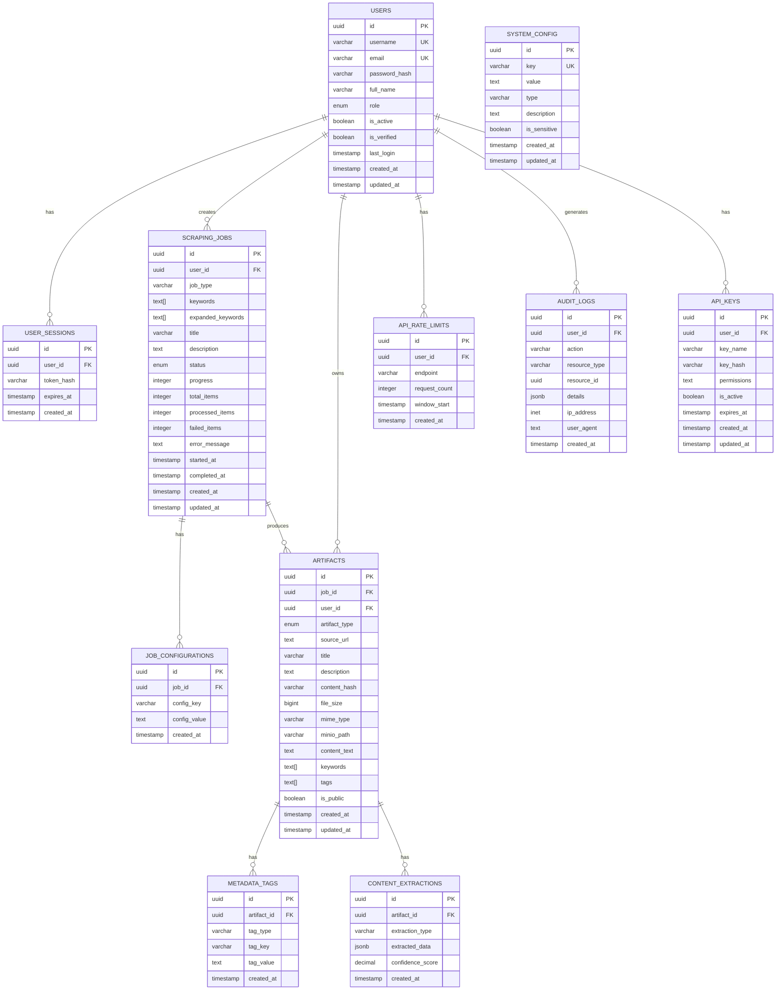

# Database Schema Documentation

## Overview

The StratLogic Scraping System uses PostgreSQL as its primary database with a comprehensive schema designed for scalability, performance, and data integrity.

## Database Schema Diagram



## Table Definitions

### 1. Users Table
**Purpose**: Store user account information and authentication data.

```sql
CREATE TABLE users (
    id UUID PRIMARY KEY DEFAULT gen_random_uuid(),
    username VARCHAR(50) UNIQUE NOT NULL,
    email VARCHAR(255) UNIQUE NOT NULL,
    hashed_password VARCHAR(255) NOT NULL,
    full_name VARCHAR(100),
    role user_role DEFAULT 'user',
    is_active BOOLEAN DEFAULT true,
    is_verified BOOLEAN DEFAULT false,
    last_login TIMESTAMP,
    created_at TIMESTAMP DEFAULT CURRENT_TIMESTAMP,
    updated_at TIMESTAMP DEFAULT CURRENT_TIMESTAMP
);
```

**Indexes**:
- `idx_users_username` (username)
- `idx_users_email` (email)
- `idx_users_role` (role)
- `idx_users_active` (is_active)

### 2. User Sessions Table
**Purpose**: Store user session tokens for authentication.

```sql
CREATE TABLE user_sessions (
    id UUID PRIMARY KEY DEFAULT gen_random_uuid(),
    user_id UUID REFERENCES users(id) ON DELETE CASCADE,
    token_hash VARCHAR(255) NOT NULL,
    expires_at TIMESTAMP NOT NULL,
    created_at TIMESTAMP DEFAULT CURRENT_TIMESTAMP
);
```

**Indexes**:
- `idx_user_sessions_user_id` (user_id)
- `idx_user_sessions_token_hash` (token_hash)
- `idx_user_sessions_expires_at` (expires_at)

### 3. Scraping Jobs Table
**Purpose**: Store scraping job information and status.

```sql
CREATE TABLE scraping_jobs (
    id UUID PRIMARY KEY DEFAULT gen_random_uuid(),
    user_id UUID REFERENCES users(id) ON DELETE CASCADE,
    job_type VARCHAR(50) NOT NULL,
    keywords TEXT[] NOT NULL,
    expanded_keywords TEXT[],
    title VARCHAR(255) NOT NULL,
    description TEXT,
    status job_status DEFAULT 'pending',
    progress INTEGER DEFAULT 0,
    total_items INTEGER DEFAULT 0,
    processed_items INTEGER DEFAULT 0,
    failed_items INTEGER DEFAULT 0,
    error_message TEXT,
    started_at TIMESTAMP,
    completed_at TIMESTAMP,
    created_at TIMESTAMP DEFAULT CURRENT_TIMESTAMP,
    updated_at TIMESTAMP DEFAULT CURRENT_TIMESTAMP
);
```

**Indexes**:
- `idx_scraping_jobs_user_id` (user_id)
- `idx_scraping_jobs_status` (status)
- `idx_scraping_jobs_type` (job_type)
- `idx_scraping_jobs_created_at` (created_at)

### 4. Job Configurations Table
**Purpose**: Store job-specific configuration parameters.

```sql
CREATE TABLE job_configurations (
    id UUID PRIMARY KEY DEFAULT gen_random_uuid(),
    job_id UUID REFERENCES scraping_jobs(id) ON DELETE CASCADE,
    config_key VARCHAR(100) NOT NULL,
    config_value TEXT,
    created_at TIMESTAMP DEFAULT CURRENT_TIMESTAMP
);
```

**Indexes**:
- `idx_job_configurations_job_id` (job_id)
- `idx_job_configurations_key` (config_key)

### 5. Artifacts Table
**Purpose**: Store scraped content and metadata.

```sql
CREATE TABLE artifacts (
    id UUID PRIMARY KEY DEFAULT gen_random_uuid(),
    job_id UUID REFERENCES scraping_jobs(id) ON DELETE CASCADE,
    user_id UUID REFERENCES users(id) ON DELETE CASCADE,
    artifact_type artifact_type NOT NULL,
    source_url TEXT,
    title VARCHAR(500),
    description TEXT,
    content_hash VARCHAR(64) NOT NULL,
    file_size BIGINT,
    mime_type VARCHAR(100),
    minio_path VARCHAR(500) NOT NULL,
    content_text TEXT,
    keywords TEXT[],
    tags TEXT[],
    is_public BOOLEAN DEFAULT false,
    created_at TIMESTAMP DEFAULT CURRENT_TIMESTAMP,
    updated_at TIMESTAMP DEFAULT CURRENT_TIMESTAMP
);
```

**Indexes**:
- `idx_artifacts_job_id` (job_id)
- `idx_artifacts_user_id` (user_id)
- `idx_artifacts_type` (artifact_type)
- `idx_artifacts_content_hash` (content_hash)
- `idx_artifacts_created_at` (created_at)
- `idx_artifacts_keywords` USING GIN (keywords)
- `idx_artifacts_tags` USING GIN (tags)

### 6. Metadata Tags Table
**Purpose**: Store flexible metadata tags for artifacts.

```sql
CREATE TABLE metadata_tags (
    id UUID PRIMARY KEY DEFAULT gen_random_uuid(),
    artifact_id UUID REFERENCES artifacts(id) ON DELETE CASCADE,
    tag_type VARCHAR(50) NOT NULL,
    tag_key VARCHAR(100) NOT NULL,
    tag_value TEXT,
    created_at TIMESTAMP DEFAULT CURRENT_TIMESTAMP
);
```

**Indexes**:
- `idx_metadata_tags_artifact_id` (artifact_id)
- `idx_metadata_tags_type_key` (tag_type, tag_key)

### 7. Content Extractions Table
**Purpose**: Store extracted content and analysis results.

```sql
CREATE TABLE content_extractions (
    id UUID PRIMARY KEY DEFAULT gen_random_uuid(),
    artifact_id UUID REFERENCES artifacts(id) ON DELETE CASCADE,
    extraction_type VARCHAR(50) NOT NULL,
    extracted_data JSONB,
    confidence_score DECIMAL(3,2),
    created_at TIMESTAMP DEFAULT CURRENT_TIMESTAMP
);
```

**Indexes**:
- `idx_content_extractions_artifact_id` (artifact_id)
- `idx_content_extractions_type` (extraction_type)
- `idx_content_extractions_data` USING GIN (extracted_data)

### 8. System Configuration Table
**Purpose**: Store system-wide configuration settings.

```sql
CREATE TABLE system_config (
    id UUID PRIMARY KEY DEFAULT gen_random_uuid(),
    key VARCHAR(100) UNIQUE NOT NULL,
    value TEXT,
    type VARCHAR(20) DEFAULT 'string',
    description TEXT,
    is_sensitive BOOLEAN DEFAULT false,
    created_at TIMESTAMP DEFAULT CURRENT_TIMESTAMP,
    updated_at TIMESTAMP DEFAULT CURRENT_TIMESTAMP
);
```

**Indexes**:
- `idx_system_config_key` (key)

### 9. API Rate Limits Table
**Purpose**: Track API usage and enforce rate limits.

```sql
CREATE TABLE api_rate_limits (
    id UUID PRIMARY KEY DEFAULT gen_random_uuid(),
    user_id UUID REFERENCES users(id) ON DELETE CASCADE,
    endpoint VARCHAR(100) NOT NULL,
    request_count INTEGER DEFAULT 0,
    window_start TIMESTAMP NOT NULL,
    created_at TIMESTAMP DEFAULT CURRENT_TIMESTAMP
);
```

**Indexes**:
- `idx_api_rate_limits_user_endpoint` (user_id, endpoint)
- `idx_api_rate_limits_window` (window_start)

### 10. Audit Logs Table
**Purpose**: Track system activities for security and compliance.

```sql
CREATE TABLE audit_logs (
    id UUID PRIMARY KEY DEFAULT gen_random_uuid(),
    user_id UUID REFERENCES users(id) ON DELETE SET NULL,
    action VARCHAR(100) NOT NULL,
    resource_type VARCHAR(50),
    resource_id UUID,
    details JSONB,
    ip_address INET,
    user_agent TEXT,
    created_at TIMESTAMP DEFAULT CURRENT_TIMESTAMP
);
```

**Indexes**:
- `idx_audit_logs_user_id` (user_id)
- `idx_audit_logs_action` (action)
- `idx_audit_logs_created_at` (created_at)
- `idx_audit_logs_details` USING GIN (details)

### 11. API Keys Table
**Purpose**: Store API keys for external integrations.

```sql
CREATE TABLE api_keys (
    id UUID PRIMARY KEY DEFAULT gen_random_uuid(),
    user_id UUID REFERENCES users(id) ON DELETE CASCADE,
    key_name VARCHAR(100) NOT NULL,
    key_hash VARCHAR(255) NOT NULL,
    permissions TEXT,
    is_active BOOLEAN DEFAULT true,
    expires_at TIMESTAMP,
    created_at TIMESTAMP DEFAULT CURRENT_TIMESTAMP,
    updated_at TIMESTAMP DEFAULT CURRENT_TIMESTAMP
);
```

**Indexes**:
- `idx_api_keys_user_id` (user_id)
- `idx_api_keys_hash` (key_hash)
- `idx_api_keys_active` (is_active)

## Custom Types

### Enums

```sql
-- Job status enumeration
CREATE TYPE job_status AS ENUM (
    'pending',
    'running',
    'completed',
    'failed',
    'cancelled'
);

-- Artifact type enumeration
CREATE TYPE artifact_type AS ENUM (
    'web_page',
    'paper',
    'government_doc',
    'social_media',
    'pdf',
    'image',
    'video',
    'audio'
);

-- User role enumeration
CREATE TYPE user_role AS ENUM (
    'user',
    'admin',
    'moderator'
);
```

## Triggers

### Updated At Trigger
Automatically update the `updated_at` timestamp when records are modified.

```sql
CREATE OR REPLACE FUNCTION update_updated_at_column()
RETURNS TRIGGER AS $$
BEGIN
    NEW.updated_at = CURRENT_TIMESTAMP;
    RETURN NEW;
END;
$$ language 'plpgsql';

-- Apply to all tables with updated_at column
CREATE TRIGGER update_users_updated_at BEFORE UPDATE ON users
    FOR EACH ROW EXECUTE FUNCTION update_updated_at_column();

CREATE TRIGGER update_scraping_jobs_updated_at BEFORE UPDATE ON scraping_jobs
    FOR EACH ROW EXECUTE FUNCTION update_updated_at_column();

CREATE TRIGGER update_artifacts_updated_at BEFORE UPDATE ON artifacts
    FOR EACH ROW EXECUTE FUNCTION update_updated_at_column();

CREATE TRIGGER update_system_config_updated_at BEFORE UPDATE ON system_config
    FOR EACH ROW EXECUTE FUNCTION update_updated_at_column();

CREATE TRIGGER update_api_keys_updated_at BEFORE UPDATE ON api_keys
    FOR EACH ROW EXECUTE FUNCTION update_updated_at_column();
```

## Performance Considerations

### Indexing Strategy
- **Primary Keys**: All tables use UUID primary keys for security
- **Foreign Keys**: Indexed for join performance
- **Search Fields**: Full-text search indexes on content fields
- **Time-based Queries**: Indexes on timestamp fields for efficient time-based queries
- **Array Fields**: GIN indexes for efficient array operations

### Partitioning Strategy
- **Audit Logs**: Consider partitioning by date for large volumes
- **Artifacts**: Consider partitioning by user_id for multi-tenant scenarios

### Maintenance
- **Vacuum**: Regular VACUUM operations for tables with frequent updates
- **Analyze**: Regular ANALYZE operations to update statistics
- **Reindex**: Periodic reindexing for heavily used indexes

## Security Considerations

### Data Protection
- **Password Hashing**: All passwords are hashed using bcrypt
- **Sensitive Data**: Sensitive configuration values are marked and encrypted
- **Audit Trail**: Comprehensive audit logging for all operations
- **Access Control**: Row-level security considerations for multi-tenant scenarios

### Backup Strategy
- **Regular Backups**: Daily automated backups
- **Point-in-Time Recovery**: WAL archiving for point-in-time recovery
- **Encrypted Backups**: All backups are encrypted at rest
- **Offsite Storage**: Backups stored in multiple locations

## Migration Strategy

### Version Control
- **Alembic**: All schema changes managed through Alembic migrations
- **Rollback Support**: All migrations support rollback operations
- **Testing**: Migrations tested in staging environment before production

### Deployment
- **Zero Downtime**: Schema changes designed for zero-downtime deployment
- **Backward Compatibility**: Maintain backward compatibility during migrations
- **Monitoring**: Monitor migration performance and impact
